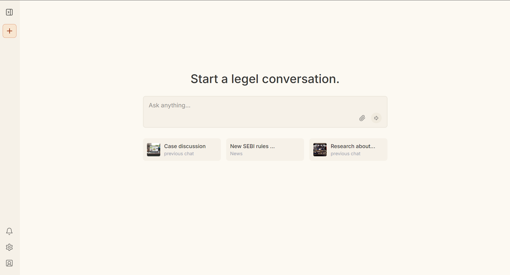
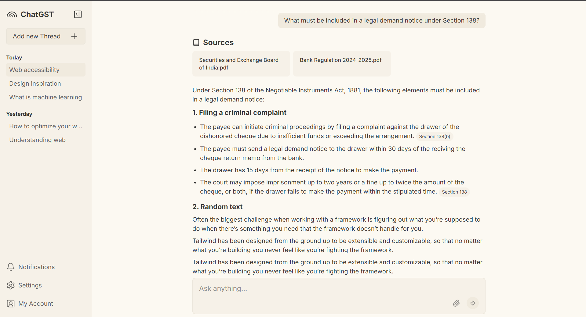
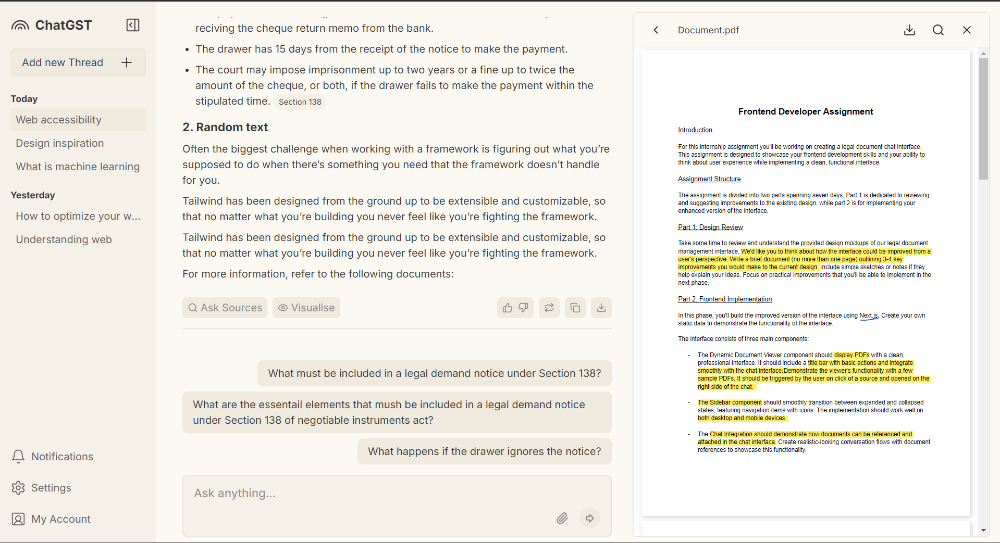

Clone the repository to your local machine:
git clone https://github.com/smiitm/smit-sarvam-assignment

Install the necessary dependencies: 
npm install

To run the development server, execute the following command:
npm run dev

